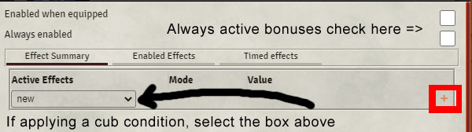

# Notice! Read all comments on macros.

These are my macros my players use in game, a large majority of them written for Midi-qol or DAE usage. I am sure there are better ways to write some of them. I am totally open if you got any suggestions how to make these better. if you need to contact me, hit me up on `Crymic#9452` or @ me on `Foundry Discord`. Special thanks to @Tposney, @Kekilla0, @Kandashi, @VanceCole for helping me along the way.

If you wish to support what I am doing, head over to my **[Patreon](https://www.patreon.com/bePatron?u=36173099)**.

I am now uploading all new macros for my Patreon's first, then after the "early release" period is over. They will be published here.


[](http://www.youtube.com/watch?v=nJbtWL83CKk "Quick Macro Guide")
<div>Youtube Video on the subjects below.</div>

# FAQ Section
* [How to add a macro?](#how-to-add-a-macro)
* [How to execute a GM macro?](#how-to-execute-a-gm-macro)
* [Why execute a macro as a GM macro?](#why-execute-a-macro-as-a-gm-macro)
* [Macro Execute](#macro-execute)
* [Item Macro](#item-macro)
* [On Use](#on-use)
* [Troubleshooting](#troubleshooting)

## How to add a macro?
On the bottom hotbar of Foundry when in-game, click on an empty space. This will create and open a macro dialogue box. Here you can inject in the code. Make sure to toggle Type to `script` instead of `chat`.


## How to execute a GM macro
To do this feature, you will need the module called [The Furance](https://github.com/kakaroto/fvtt-module-furnace), this will give you the ability to `Execute Macro as GM`.

## Why execute a macro as a GM macro
Foundry does **not** allow players to modify other players or npcs, only themselves. The GM however has the power to do this. So to get around this, the player can callback to a macro which has permissions to run at a GM level. The only drawback with this is a GM must be logged in and present for this to work.

## Macro Execute
This method of macro execution requires a macro stored on a users hotbar. To `call` to this macro from within DAE itself, you will need to do the following steps. First locate the item you wish to apply the macro to. Then drag it from the character to your items directory on the right side tool bar, and open it. At the top, click on the `DAE button`. Next, click on the little `+` symbol on the right hand side. Name the Active Effect whatever the item is, it will help reference if you need to later. Now click on the far right tab for `Effects`. Hit the `+` symbol to add a line.
In the dropdown list on the left, at the absolute bottom is `Macro Execute` and select it. The second field should say `Custom`, in the value field we want to enter in `Macro Name` to reference the macro on the hotbar. Now in my notes I will often have `@target` mentioned as well or other *variables*. You will need to include those too.

So all together could be `macro.execute custom "Rage" @target`.





## Item Macro
Now instead of click on your hotbar to add the macro, you can instead go directly to the item and edit it. Above the item, you'll see one for `Item Macro`. Once you've clicked it a macro window will open, here paste or type in your macro. When done, save it.


Now, we need to let DAE know to use this new item macro we just installed. Much like the previous steps above, instead of choosing `Macro Execute`,  choose `Item Macro`. This time we are **not** going to reference a macro name, because we don't need one. Alternatively, we only need to reference the variables which are going to be passed to the macro instead. So, `@target` is all we need.


## On Use
Recent changes to DAE, now makes all macros run automatically as `macro execute` status. This becomes a problem when involving `dialog boxes`. The `dialog box` will only show for the GM. To solve this issue, we need to use Midi-Qol's `On Use` feature.

New fields we can call upon..
```
actor = actor.data (the actor using the item)
item = item.data (the item, i.e. spell/weapon/feat)
targets = [token.data] (an array of token data taken from game.user.targets)
hitTargets = [token.data] (and arry of tokend ata take from targets that were hit)
saves = [token.data] (and arry of tokend ata take from targets that made a save)
failedSaves = [token.data] (and arry of tokend ata take from targets that failed the save)
damageRoll = the Roll object for the damage roll (if any)
attackRoll = the Roll object for the attack roll (if any)
itemCardId = the id of the chat message item card (see below)
isCritical = true/false
isFumble = true/false
spellLevel = spell/item level
damageTotal = damage total
damageDetail = [type: string, damage: number] an array of the specific damage items for the attack/spell e.g. [{type: "piercing", damage: 10}]
```
First go into the Midi-Qol's module settings and click on `Workflow Settings`. Down at the very bottom you will see `add macro to call on use`, check it and save.


Now when looking at an item's `details`. At the very bottom, there is a new field called `On Use Macro`, here enter `ItemMacro`.


Then add the macro as normal to `Item Macro`. Make sure to **remove** any DAE `Item Macro` calls.

## Troubleshooting
### Nothing happens when I use your macro
Always read the comments section of the macro at the start of it, they are noted with a "//". Usually I will mention what secondary macros are reqires in order to run.
>// at the top of the macro there is always detailed information. Please read it.
### Still nothing happens when I use your macro
Often some macros use `callback` macros. These need to be placed on the *GM's hotbar* and marked as `Execute as GM`. Some of these `callback` macros I have written, others are done by other authors. Check my [Callback Macros](https://gitlab.com/crymic/foundry-vtt-macros/-/tree/master/Callback%20Macros) folder for more details.

You can also disable both options inside `Item Macro` module. Some people have reported that it fixed the issue.


### I get an error when using the macro
Sometimes you clipped something at the bottom of the macro. Try using `ctrl + a`, `ctrl + c` to copy then `ctrl + v` to paste it. This will ensure you get everything.
