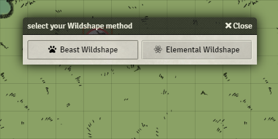
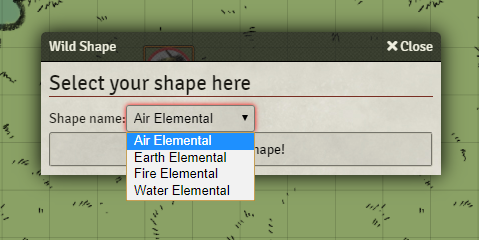
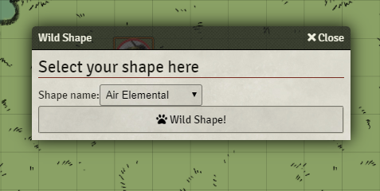

Wildshaping with relative ease!

-What do you need for it to work?

If you are running 0.7.10 get the version with (0710) in the name.
If running 0.8.9 get the normal version.

-How does it work?

-Step 1:

add the contents of the script to a macro and give this a nice name and icon, give the druid player ownership of the macro.
and make sure the actor has a Resource called Wildshape.

-Step 2:

Create a compendium of shapes. In these Macros the name "Shapes Compedium" is used. 
So to avoid issues of editing the key to find the right compendium, I suggest using this name.
Fill it with Beast / Elemental Actors of which your Druid knows the shape. It is even future proofed as the 
player will only get to select the Actors they are able to use according to the rules.

-Step 3:

Have fun using it!

